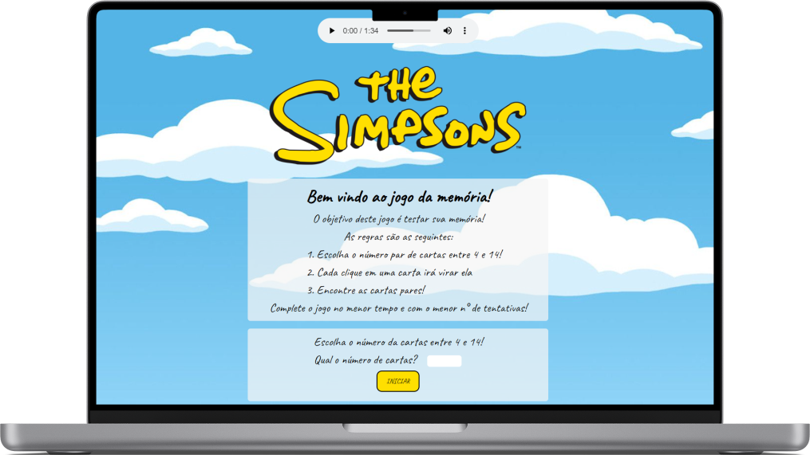
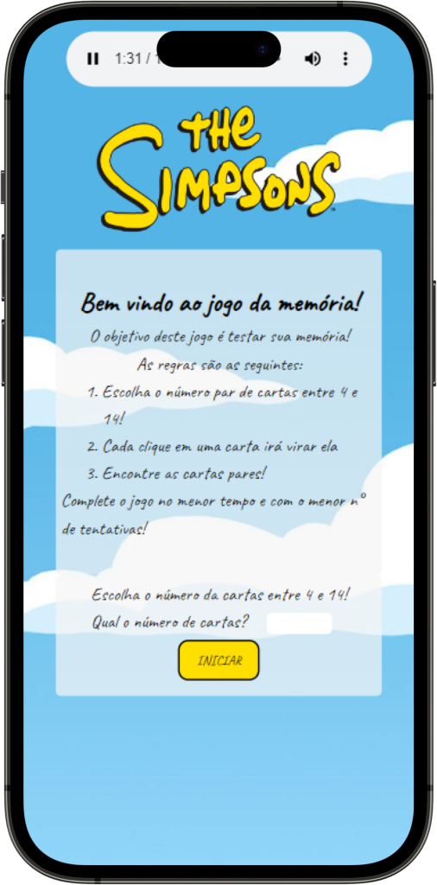

<h1>Simpsons memory game</h1>

This project is a memory game, with a theme focused on the animated series and sitcom The Simpsons. 

The development was aimed at manipulating the DOM, with the aim of training and improving basic techniques. The technologies used were: 

<ol>
  <ul>HTML5</ul>
  <ul>CSS3</ul>
</ol>

<h2>Installation</h2>

To install this project, follow these steps:

<ol>
  <li>Clone the repository: <code>git clone https://github.com/Hoffmann-Ferreira/Memory-game.git</code></li>
  <li>Install dependencies: <code>npm install</code></li>
</ol>

<h2>Final design</h2>

